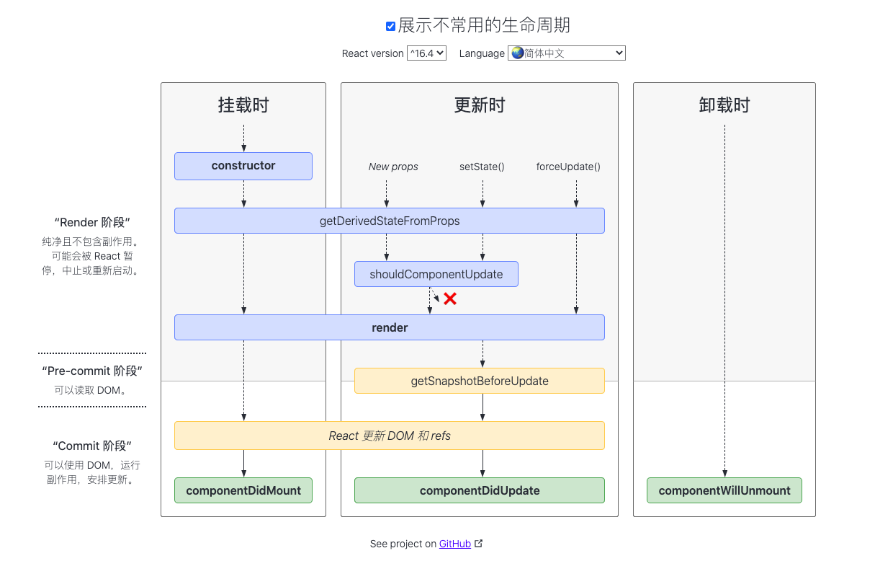

# React技术栈入门学习笔记

## Todo

- useEffect https://overreacted.io/zh-hans/a-complete-guide-to-useeffect/

## React

### React是什么

>用于构建用户界面的 JavaScript 库

React和react-router, react-redux等结合起来才叫框架。

### JSX

JSX 是一个基于 JavaScript + XML 的一个扩展语法。

```js
React.render(
	<h1>hello react</h1>,
  document.getElementById('box')
)
// jsx编译成js后
React.render(
	React.createElement('h1',null,'hello react'),
  document.getElementById('box')
)
```

#### JSX使用注意事项

- 有且仅有一个顶层包含元素（React.Fragment）
- JSX 不是html，很多属性在编写时不一样
  - class ➡️ className
  - style：接受一个采用小驼峰命名属性的 JavaScript 对象，而不是 CSS 字符串。
- 列表渲染时，必须有 key 值。key值：1）唯一；2）不变。
- JSX 所有标签必须闭合
- 组件的首字母一定大写，标签一定要小写

### props和state

state 和 props 都可以决定组件的外观和显示状态。通常，props 做为不变数据或者初始化数据传递给组件，可变状态使用 state。

#### state

state 的主要作用是用于组件保存、控制、修改*自己*的可变状态，在组件内部进行初始化，也可以在组件内部进行修改（**通过`setState()`修改**），但是组件外部不能修改组件的 state。

#### props

props 的主要作用是让使用该组件的父组件可以传入参数来配置该组件，它是外部传进来的配置参数，组件内部无法控制也无法修改。（**单向数据流**）

### 组件

- 类组件

- 函数组件

#### 组件间通信

**组件间数据的传递是自上而下的。**

- 父传子:
  父组件调用子组件时把数据添加子组件的属性中，然后子组件中从props属性中，获取父级传递过来的数据。

- 子传父:
  在父级中定义相关的数据操作方法(或其他回调)，把该方法传递给子级，在子级中调用该方法向父级传递数据。

-  兄传弟:
  将数据托管在父级上，然后分别传给子级。

- 跨组件

  Context 通过组件树提供了一个传递数据的方法，从而避免了在每一个层级手动的传递 props 属性。

  **注意在使用不熟练时，最好不要在项目中使用 context，context一般给第三方库使用**

  - 传递数据

    在父组件调用 Provider ，通过属性 value 传递数据。

  - 接收数据

    - 在子孙组件调用 Consumer 获取 Context 中的数据。
- ```static contextType=Context```，通过 ```this.context```即可获得数据。

#### 受控与非受控

- 受控组件: 让 表单控件 的内部状态  和 state 保持一致。设置 value 的同时，配合着 onChange 事件使组件变为受控组件。
- 非受控组件: 不需要同步 value 值，需要设置为defaultValue、defaultChecked

#### 类组件生命周期



- 挂载 （组件创建 ➡️ 组件创建的虚拟DOM生成真实DOM，添加到DOM树中）
  - constructor()
  - static getDerivedStateFromProps(props) 
    - 注意 this 问题
  - render()
  - componentDidMount - 处理副作用（请求）
- 更新 -- 组件重新渲染
     - static getDerivedStateFromProps(props, state)
     - shouldComponentUpdate() - 判断是否更新
     - render()
     - getSnapshotBeforeUpdate() 
     - componentDidUpdate() - 处理副作用（请求）
- 卸载阶段
  - componentWillUnmount - 删除添加在全局的一些信息或操作（清除timer等）

### 常用 Hooks

- useState  

- useEffect
- useRef

## React Router

现阶段使用的是基于 Web 的 React Router。

- BrowserRouter 组件 - history

  基于 HTML5 History API 的路由组件

- HashRouter 组件 - hash

  基于 URL Hash 的路由组件

### 组件

#### Route

通过该组件来设置应用单个路由信息。当 URL 与当前 Route 设置的 path 属性匹配的时候，Route 组件所在的区域呈现的就是就是 Route 设置的 component。

##### 属性

- exact

  exact 属性表示路由使用 精确匹配模式。非 exact 模式下 '/' 会匹配所有以 '/' 开头的路由。

- render

  render 属性指定渲染函数。render 属性值是一个函数，当路由匹配的时候指定该函数进行渲染，可以向该函数返回的组件传递数据。

#### Link

Link 组件用来处理 a 链接 类似的功能（它会在页面中生成一个 a 标签），但设置这里需要注意的，react-router-dom 拦截了实际 a 标签的默认动作，然后根据所有使用的路由模式（Hash 或者 HTML5）来进行处理，改变了 URL，但不会发生请求，同时根据 Route 中的设置把对应的组件显示在指定的位置。

##### 属性

- to

  to 属性类似 a 标签中的 href。

#### NavLink 组件

NavLink 与 Link 类似，但是它提供了特殊属性用来处理页面导航

##### 特殊属性

- activeStyle

  当当前 URL 与 NavLink 中的 to 匹配的时候，激活 activeStyle 中的样式。

- activeClassName

  与 activeStyle 类似，但是激活的是 className。

- isActive

  默认情况下，匹配的是 URL 与 to 的设置，通过 isActive 可以自定义激活逻辑，isActive 是一个函数，返回布尔值。

#### Switch 组件

该组件只会渲染首个被匹配的组件

#### Redirect 组件

##### 属性

- to

  设置跳转的 URL

### 路由传参

#### withRouter 组件

通过 withRouter 方法来注入路由对象。如果一个组件不是路由绑定组件，那么该组件的 props 中是没有路由相关对象的，虽然我们可以通过传参的方式传入，但是如果结构复杂，这样做会特别的繁琐。

### Hooks

- useHistory
- useLocation
- useParams
- useRouteMatch

## React-Redux

- 只允许一个store（可以导出多个，但是只能使用一个）
- 使用 Provider 组件包裹 整个应用
  - 在 Provider 中有一个 store 属性，store 属性中传入的是 redux 的 store

### 如何在组件中获取 redux 的 store

- connect 高阶组件 (传入函数，返回一个新的函数)，将组件需要的state，以及dispatch 传给组件

  - connect(callback) - callback 可以拿到 state  ，返回需要用到的 state 

  - callback 必须有一个对象类型的返回值，该返回值决定了哪些参数需要传递给组件

  - connect 被调用后 会返回一个高阶组件，高阶组件再调用返回可以使用redux的组件

  - 在组件的props可以拿到筛选后的state和dispatch方法

    **配合redux就能使用了**

- react-redux 提供的 hooks (react-redux 版本7):

  - useDispatch 获取 dispatch
  - useStore 获取 store
  - useSelector 获取 state  

### 异步操作中间件：redux-thunk

- thunk 中间件：使 action 支持 函数

  - 如果 action 是对象的话，则 直接调用 reducer 发起修改

  - 如果 action 是函数，则 执行该函数，并将 getState 和 dispatch 传递给该函数

## 小知识点

### 严格模式

- 识别具有不安全生命周期的组件
- 有关旧式字符串ref用法的警告
- 检测意外的副作用
- 检测遗留 context API

### CSS Modules

没有使用css模块化，则引入css文件时，父子组件都会生效样式。使用css模块化，避免样式冲突的问题。

- 在 create-react-app 中的使用：
  - .css .sass 正常文件
  - [name].module.css [name].module.sass 需要模块化的文件
  - 引入时当成变量引入，这个变量是一个对象，里面是样式名与编译后的样式名
- CSS Modules 使用
  - 局部 声明:local(.className) .className 使用 styled.className 。.box和#box会编译成一样的名字，但样式是正确的。
  - 全局 :global(.className)，不编译该样式名，全局生效
  - composes 引入其他样式

