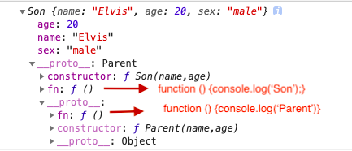
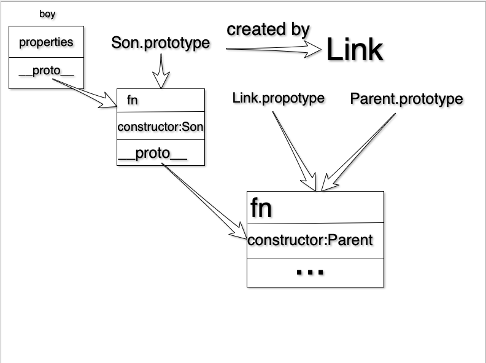

# 原型继承

## 深拷贝

```js
function deepCopy(obj) {
    let newObj = Array.isArray(obj)?[]:{};
    for(let key in obj){
      // in 运算符会遍历那些从原型链上继承到的属性。
        if(obj.hasOwnProperty(key)){
          // hasOwnProperty 忽略从原型链上继承到的属性。
            if(typeof obj[key] === "object"){
                newObj[key] = deepCopy(obj[key]) ;
            }else{
                newObj[key] = obj[key];
            }
        }
    }
    return newObj;
}

function Parent(name,age) {
    this.name = name;
    this.age = age;
}
Dad.prototype.fn = function () {
    console.log("Parent");
}

function Son(name,age) {
    Dad.call(this,name,age);
    this.sex = "male";
}
// 原型继承
Son.prototype =deepCopy(Dad.prototype);
// fn重写
Son.prototype.fn = function () {
    console.log("Son");
}
```

## 组合继承

```js
function Parent(name,age) {
    this.name = name;
    this.age = age;
}
Parent.prototype.fn = function () {
    console.log("Parent");
}

function Son(name,age) {
    Parent.call(this,name,age);
    this.sex = "male";
}
// 构造函数Link
let Link = function(){};
Link.prototype = Parent.prototype;
// Son.prototype 为 Link 实例化的一个对象。
// Son.prototype.__proto__===Link.prototype===Parent.prototype
Son.prototype = new Link();
// Son.prototype 原本的 constructor 为 Parent，在 Parent.prototype 中。
// 改变 Son.prototype 为 Son，则 Son 实例化的对象的 constructor 为Son
Son.prototype.constructor = Son;
// fn重写
Son.prototype.fn = function () {
    console.log("Son");
}
let boy = new Son("Elvis",20);
console.log(boy); 
boy.fn();	// Son
```



